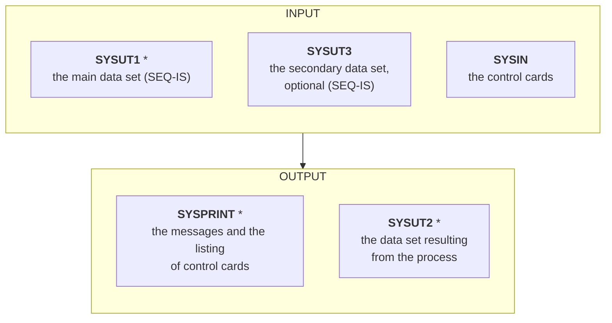
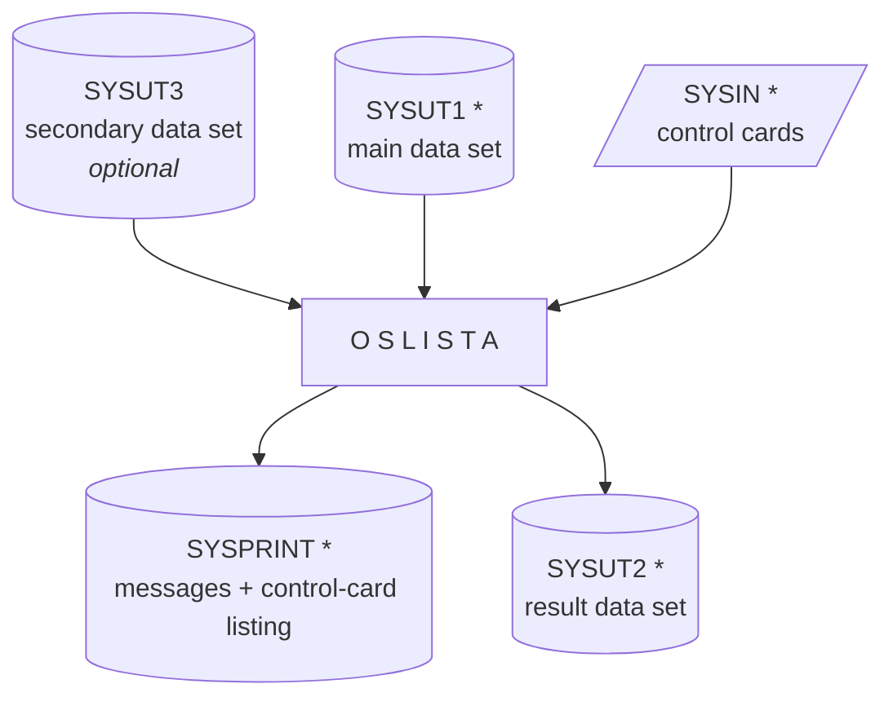
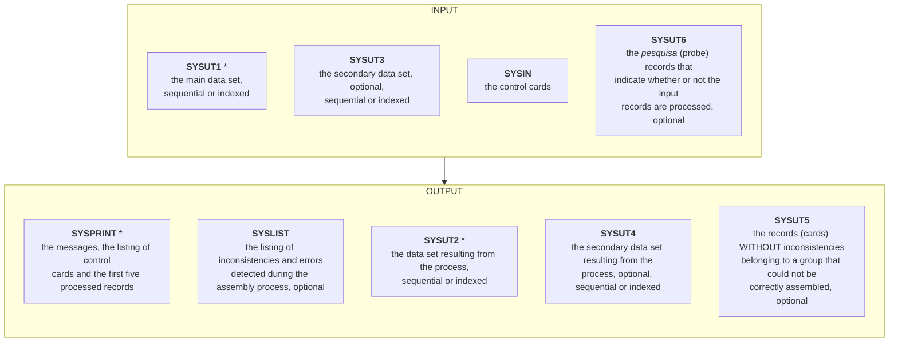
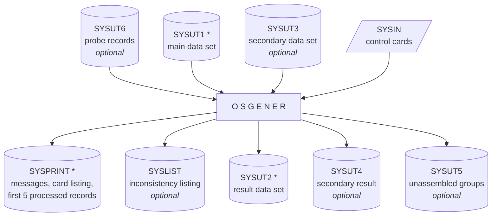

# OSLISTA / OSGENER — Utility Programs Manual

**SCD — Centro de Cómputos — Departamento de Ingeniería**
**Publication 1/84**

---

## About this translation

This is a complete English translation of `docs/manual/OSLSGEN.txt`, the transcription of
the original SCD (Centro de Cómputos, Departamento de Ingeniería) publication 1/84 covering
the `OSLISTA` and `OSGENER` mainframe utilities.

Translation conventions:

- **Syntax boxes, control-card examples and table data are reproduced verbatim** — they are
  code, not prose. Only the surrounding prose is translated.
- The original is paginated in *hojas* (sheets). Sheet numbers are preserved as headings so
  cross-references back to the source remain valid.
- The source text is an OCR/typed transcription and contains a number of obvious
  transcription slips (`SR02` for `SR=2`, `Sil` for `Si1`, `1;80` for `1,80`, …). These are
  left **as printed** in the examples and are catalogued in
  [Appendix A — Transcription anomalies](#appendix-a--transcription-anomalies).
- Every diagram in the original — the Input/Output summaries (sheets 2 and 21), the file
  connectivity charts (sheets 3 and 22) and the functional processing schemas (sheets 18–19
  and 36–37) — was drawn as ASCII art in CP437 box-drawing characters. All of them are
  redrawn here as **Mermaid** `flowchart` diagrams; node content and topology are unchanged.
- Spanish accents are absent from the source (it was typed on mainframe equipment limited to
  the uppercase EBCDIC repertoire). Translated prose uses normal English orthography.

---

## Index

| Section | Sheet |
|---|---|
| [Introduction](#introduction) | 1 |
| [OSLISTA](#part-i--oslista) | 2 |
| [OSGENER](#part-ii--osgener) | 20 |

---

## Introduction

*(Sheet 1)*

These utilities may be invoked to perform data management, print reports, and copy or
generate files. In certain situations they can replace the coding of programs in COBOL, with
the savings in resources that this implies — whether software, hardware and/or human.

The basic function of **OSLISTA**, as its name indicates, is to produce listings from data
sets, additionally supporting the following functions: field selection, arithmetic
operations, encoding and decoding by means of external tables, conditioning of functions,
totalling for the printing of control-break totals, and title printing.

**OSGENER**, as its name indicates, is used basically to generate files, additionally
fulfilling the following functions: field selection, arithmetic operations, encoding and
decoding by means of external tables, conditioning of functions, consistency checking,
addition of a check digit (modulo 10), and combination of two files.

Both programs work with non-VSAM data sets (sequential and/or indexed sequential).

---
---

# PART I — OSLISTA

## Utility program OSLISTA

*(Sheet 2)*

The OSLISTA program prints the whole of, or selected fields from, a data set (SEQ-IS),
supporting the following functions:

- Field selection, with or without editing.
- Arithmetic operations with fields and numeric literals.
- Encoding or decoding of fields by means of tables.
- Conditioning of the above functions on the basis of data present in the input data sets.
- Record selection by count and/or key.
- Summing of fields and the printing of totals at control breaks.
- Title printing.

### Input / Output



Other optional input data sets may exist, containing the tables for encoding/decoding
(see the [CONV](#conv-oslista) card).

Every kind of format is accepted in the input records, **except SPANNED**.

### File connectivity diagram

*(Sheet 3)*



`*` = **required**.

### Coding of the control card

The control instructions are coded over the 80 columns of the card.

| Element | Rule |
|---|---|
| **Operation code** | Required, and must begin in **column 1**. |
| **Operands** | Operands must be preceded by an operation code and at least one blank; they may be positional or keyword. |
| **Card continuation** | A new card must be coded with an operation code and operands (**except for the TIT card**). |

---

## Control cards — summary

*(Sheet 4)*

| Card | Purpose |
|---|---|
| **PRINT** | Specifies that the whole record is to be printed, specifying spacing jumps and the omission of some records (SKIP). It is independent of the others except RCIN/RCOUT and TIT. |
| **TIT** | Specifies the characteristics of the heading of each sheet of the report. Up to 9 are accepted. |
| **CLAVE** | Specifies key data when MATCHING between SYSUT1 and SYSUT3 is required. |
| **RCIN / RCOUT** | Specifies the conditions under which a record is to be processed (RCIN) or skipped (RCOUT), by comparison of key and/or record count during the process. |
| **COND** | Specifies the conditions to be tested during the process. If any of them is met, the condition indicator is switched on **for the whole processing of one logical record**. |
| **ACUM** | Specifies the arithmetic operations to be performed with fields of the input records. |
| **FIELD** | Specifies the selections and/or conversions and/or edits to be performed on given fields. |
| **CONV** | Specifies the encoding or decoding to be performed on the input fields according to tables. |
| **CORTE** | Specifies the fields on which a control break is to be taken. They are given from major to minor. Maximum count = 10. |
| **IMCOR** | Specifies the fields to be summed and their edits at each control break. |
| **CARRO** | Specifies the carriage-control characters for each of the lines to be printed. |

---

## Control cards — detail

*(Sheet 5)*

The OSLISTA program is controlled by combinations of the following control cards.

### PRINT

Specifies that the whole record is to be printed as indicated.

```
           [C ]                              [1]      [1]
PRINT  {FL=[X ]},{FR=nn},{LR=nn},{SK=nn},{SP=[2]},{SR=[2]}
           [XC]                              [3]      [3]
```

| Operand | Meaning |
|---|---|
| `FL=` | Print format: `C` characters; `X` hexadecimal; `XC` mixed (assumed). |
| `FR=nn` | Sequence number of the first input logical record to process; assumes 1. |
| `LR=nn` | Sequence number of the last input logical record to process; assumes infinity. |
| `SK=nn` | Number of logical records to skip for each logical record processed; assumes 0. |
| `SP=` | Spacing between printed lines belonging to the **same** logical record; 1, 2, 3; assumes 1. |
| `SR=` | Spacing between printed lines belonging to **different** input logical records; 1, 2, 3; assumes 1. |

> **NOTE** — This option is entirely independent of the others, except RCIN/RCOUT and TIT.

**Examples**

```
columnas
-------- 1         2         3         4         5         6
1234567890123456789012345678901234567890123456789012345678901234567
PRINT FL=X,FR=2000,SK=10,SP=1,SR=2
PRINT FL=C,SR02
PRINT FR=9000
```

---

### TIT (OSLISTA)

*(Sheet 6)*

Specifies the characteristics of the report heading. Up to 9 title lines may be coded.

```
   [TIT1]
   [ -- ]                    {[FN  ] }
   [ -- ]{(Si,long,conv,so),}{[FNnn],}{Sn,}'literal'
   [ -- ]                    {[FA  ] }
   [TIT9]                    {[FAnn] }
```

| Operand | Meaning |
|---|---|
| `(Si,long,conv,so)` | Indicates that a field of the input file will be printed on the title line. Its coding is the same as that of the [FIELD](#field-oslista) card. |
| `FN` | Indicates that this line will include the current date in the form `DD/MM/AA` (assumes position 91). |
| `FNnn` | As above, but `nn` gives the starting position of the field on the line. |
| `FA` | Indicates that this line will include the current date in alphabetic form (assumes position 91). |
| `FAnn` | As above, but `nn` gives the starting position of the field on the line. |
| `Sn` | Indicates the spacing to follow the line; 1, 2 or 3 may be coded; assumes 1. |
| `Lnn` | Indicates the starting position on the line of the specified literal; assumes 1. |
| `'literal'` | Specifies the information the line is to contain; it may be continued on another control card. |

The first line is **always** printed (except when the [CARRO](#carro) card is specified), and
includes the user's identifying legend and `-PAGINA XXXXX` starting at position 110.

The date lengths are:

- numeric — 8 positions
- alphabetic — 18 positions

**Examples**

```
columnas
-------- 1         2         3         4         5         6
1234567890123456789012345678901234567890123456789012345678901234567
TIT1 FA10,S2,140,'PRIMER TITULO EJEMPLO'
TIT2 'ESTE ES UN EJEMPLO DE UNA SEGUNDA LINEA DE TITULO'
TIT3 'ESTE TITULO CONTINUA EN OTRA FICHA
CONTINUACION TITULO 3'
TIT4 (32,5,,21),'LISTADO DE SUCURSAL XXXXX'
TIT5 S3,'**********************************************'
```

---

### CLAVE

*(Sheet 7)*

Specifies the location of the relating key in the sequential data sets SYSUT1 and SYSUT3.

```
CLAVE     Sil,long,Si2
```

| Operand | Meaning |
|---|---|
| `Si1` | Starting position of the key field in the input logical record (SYSUT1). |
| `long` | Length of the key field. |
| `Si2` | Starting position of the key field in the input logical record (SYSUT3). |

> **NOTE** — This card must be coded if the optional input file SYSUT3 is used.
> Obviously, for correct operation it is necessary to sort both files on the corresponding key.

**Examples**

```
columnas
-------- 1         2         3         4         5         6
1234567890123456789012345678901234567890123456789012345678901234567
CLAVE    1,8,1
CLAVE    10,5,24
CLAVE   13,2,18
CLAVE   174,20,22
```

---

### RCIN / RCOUT

*(Sheet 8)*

Specifies the conditions under which a record is to be processed (RCIN) or skipped (RCOUT),
by comparison of keys and/or record count during the process. Its parameters are all
positional.

```
                              {  /  }
 [ RCIN][Si,op,['literal'   ]]{.AND.}
 [     ][      [X'literal X']]{ .Y. }  ............
 [RCOUT][                    ]{.OR. }
        [op,cuenta           ]{ .O. }
```

| Operand | Meaning |
|---|---|
| `Si` | Starting position of the key in the input logical record. To indicate that the **secondary** file (SYSUT3) is being referenced, the letter `S` is prefixed (example `S12`). |
| `op` | Comparison operand, comparing the record's key against the `'literal'` key, or the actual record count against the `cuenta` parameter. The following codes are valid: `EQ`, `NE`, `LT`, `GT`, `LE`, `GE`, `NL`, `NH`; if omitted, `EQ` is assumed. If the condition is met the record is processed (RCIN) or skipped (RCOUT). The comparison is performed as: `record key : 'literal' key` / `actual record count : cuenta parameter`. |
| `'literal'` | Key for the comparison, which is performed using the length of this field. |
| `X'literal X'` | Key for the comparison given in hexadecimal format; the comparison is performed using the length of the field converted to EBCDIC. |
| `cuenta` | Record-count value used for the comparison. |

Several conditions may be specified, separated by the character `/` or connected with the
logical connectors `.AND.`/`.Y.` or `.OR.`/`.O.`, with the restriction that the connectors
`.AND.`/`.Y.` and `.OR.`/`.O.` **may not be specified together** in one chain of conditions.

The use of `/` is equivalent to the `.O.` connector.

The maximum number of supported conditions is **150**.

**Examples**

```
columnas
--------
         1         2         3         4         5         6
1234567890123456789012345678901234567890123456789012345678901234567
RCIN 9,NE,'c:2345'/24,GT,'888'
RCIN 27,,'9'.Y.20,,5.Y.180,GT,'68'.Y.LT,18000
RCIN 17,NE,'7'/285,LT,'36'/47,,X'150F'.O.47,,X'150C'
RCIN   GT.4000.AND.LT,5000/GT,6000.Y.LT,10000
RCOUT  LT,8000
RCOUT  475,LE,'4856'.OR.13,NE,'3'
RCOUT S17,GT,'18'/17,GE,'70'.Y.22,,'9'
```

---

### COND

*(Sheet 9)*

Specifies the conditions to be tested during the process. If any of them is met, the
condition indicator is switched on for the whole processing of one logical record.

```
            [                    ]{  /  }
 CONDx      [Si,op,['literal'   ]]{.AND.}
            [      [X'literal X']]{ .Y. }...........
            [                    ]{.OR. }
            [OP,cuenta           ]{ .O. }
```

| Operand | Meaning |
|---|---|
| `x` | May be **1 to 8**, and specifies the indicator of the following condition. |
| `Si` | Starting position of the field to be tested in the input record. To indicate that the **secondary** file (SYSUT3) is being referenced, the letter `S` is prefixed (example `S12`). |
| `op` | Comparison operand, comparing the record's key against the `'literal'` key, or the actual record count against the `cuenta` parameter. The following codes are valid: `EQ`, `NE`, `LT`, `GT`, `LE`, `GE`, `NL`, `NH`; if omitted, `EQ` is assumed. If any condition is met, indicator `(x)` of the COND is switched on. The comparison is performed as: `record key : 'literal' key` / `actual record count : cuenta parameter`. |
| `'literal'` | Key for the comparison, which is performed using the length of this field. |
| `X'literal'` | Key for the comparison given in hexadecimal format; the comparison is performed using the length of the field converted to EBCDIC. |
| `cuenta` | Record-count value used for the comparison. |

Several conditions may be specified, separated by the character `/` or linked with the
logical connectors `.AND.`/`.Y.` or `.OR.`/`.O.`, with the restriction that the connectors
`.AND.`/`.Y.` and `.OR.`/`.O.` may not be specified together in one chain of conditions.

The use of `/` is equivalent to the logical connector `.O.`.

The maximum number of supported conditions is **150**.

**Examples**

```
columnas
-------- 1         2         3         4         5         6
1234567890123456789012345678901234567890123456789012345678901234567
COND1  4,,'10'.Y.28,LT,'260'/4,,'20'.Y.29,LT,'260'
COND7  18,GE,'1990'
COND6  GT,2500.Y.LT,5000
COND3  18,,X'14F'/18,,X'14C'
COND2  34,LT,'889'.Y.787,,'BANCO RURAL'.Y.810,,'SUC: CENTRO'
COND1 S10,,'4'/70,,'A'/70,,'C'/70,,'D'/70,,'S'/70,,'7'/70,,'9'
```

---

### ACUM

*(Sheet 10)*

Specifies the arithmetic operations to be performed with fields of the input records.

```
   [ACUMy ] [Cod.op,formato,Si,long]
   [      ] [                      ] /................
   [ACUMyx] [Cod.op,num            ]
```

| Operand | Meaning |
|---|---|
| `ACUMyx` — `y` | Indicates that the operation is to be performed on accumulator `y` (**1 to 9**). |
| `ACUMyx` — `x` | Indicates that the operations will only be performed when condition `x` (**1 to 8**) is met. |
| `Cod.op` | Type of arithmetic operation to perform: `+` = addition; `-` = subtraction; `*` = multiplication; `/` = division. |
| `formato` | Format of the field taking part in the operation: `P` = packed decimal, signed; `Z` = zoned decimal; `S` = packed decimal, unsigned; `B` = binary. |
| `Si` | Starting position of the field in the input logical record; to indicate that it belongs to the **secondary** file (SYSUT3), the letter `S` is prefixed (`S12`). |
| `long` | Length of the field. |
| `num` | Numeric literal taking part in the operation. |

Each accumulator supports a maximum of **10 arithmetic operations**, and to that end the
whole description of them must fit on a **single card**.

**Examples**

```
columnas
-------- 1         2         3         4         5         6
1234567890123456789012345678901234567890123456789012345678901234567
ACUM1  +,Z,18,8/*,2000/-,B,9,3//,6/+,P,5,4
ACUM2  +,Z,40,8/*,200/-,B,8,2/+,S,492,8/-,Z,150,3/*8
ACUM32 -,Z,6,3/*,Z,18,2//,S,25,3
ACUM88  +,Z,188,6/+,Z,188,6/*,Z,188,6   (elevo al cubo)
ACUM35  +,Z,68,8//,48/*,2000/-,S,24,6/*15
ACUM36  +,Z,400,9/+,50//100  (conversion $ Ley 18188 y redondeo)
```

*(Example comments, translated: `elevo al cubo` = "raise to the cube"; `conversion $ Ley
18188 y redondeo` = "$ Law 18188 conversion and rounding".)*

---

### FIELD (OSLISTA)

*(Sheet 11)*

Specifies the selections and/or conversions and/or edits to be performed on given fields of
a record.

```
    [FIELD ]         [Si,long,{conv}]
    [      ] EC=xy / [              ] ,so/...........
    [FIELDx]         [              ]
                     [Ay,conv       ]
                     ['literal'     ]
```

| Operand | Meaning |
|---|---|
| `x` | Indicates that the specified operations will only be performed when condition `x` (**1 to 8**) is met. |
| `EC=xy` | Controls the spacing of the listing. `x` and `y` may take the values 1, 2 or 3, representing: `x` — spacing between lines of the **same** record; `y` — spacing between lines of **different** records. The default values are 1 and 1 respectively. |
| `Si` | Starting position of the field in the input logical record. To indicate the secondary file, the letter `S` is prefixed (example `S12`). |
| `long` | Length of the field. The maximum length is given by the type of conversion: `UNPK` — 8; `MOVE` — 132; `HEXA` — 64. |
| `conv` | Code of the conversion or edit to perform (see below). |
| `'literal'` | A literal to be transferred to the output unchanged. |
| `so` | Starting position of the field in the output (**1 to 132**). Up to 9 print lines may be specified: for the second line `Snnn` must be coded, for the third `Tnnn`, fourth `Cnnn`, fifth `Qnnn`, sixth `Xnnn`, seventh `Pnnn`, eighth `Onnn` and ninth `Nnnn`. |
| `Ay` | Specifies that the field to be processed is accumulator `y` (**1 to 9**). |

**Conversion codes (`conv`)**

| Code | Meaning |
|---|---|
| `MOVE`, `M` | Transfer without change. **Assumed** (default). |
| `UNPK`, `U` | Unpack the field; the output length is `(2 · long − 1)`. |
| `HEXA`, `H` | Convert to hexadecimal; the output length is `(2 · long)`. |
| `ZxDy` | An edit is performed and the field in the input is in **zoned** format. |
| `PxDy` | An edit is performed and the field in the input is in **pack** format. |

where, for `ZxDy` / `PxDy`:

- `x` — total number of numeric digits of the edit (`1, 3, 5, 7, 9, B, D, F`).
- `y` — number of decimal digits of the edit (`1, 2, 3, 4`).

The maximum number of operations is **125**.

**Examples**

*(Sheet 12)*

```
columnas
-------- 1         2         3         4         5         6
1234567890123456789012345678901234567890123456789012345678901234567
FIELD EC=12/18,2,M,4/20,4,,10/24,6,U,20/30,5,P7D1,38/
FIELD 36,4,M,48/42,8,,O8/58,7,Z9D2,70/'TIPO DE TAREA',88
FIELD 70,10,Z7D0,104/80,30,,S1/204,12,M,S42/A5,Z9D2,69
FIELD S2,5,,S90/8,10,P8D2,S70/270,80,,T1/S90,100,,X10
FIELD 22,2,,20/'/',22/24,2,,23/'/',25/26,2,,26
```

---

### CONV (OSLISTA)

*(Sheet 13)*

Specifies the encoding or decoding to be performed on the input fields by means of a
sequential file included in SYSIN or with a dedicated DD. The useful fields of this file will
be held in memory in the form of encoding or decoding tables.

```
   [CONV ]{TITx/}{DD=ddname}/{nnK/}Si,Long.1,SiA/So,long2,SiF{/INT}
   [     ]
   [CONVx]
```

| Operand | Meaning |
|---|---|
| `CONVx` — `x` | The indicated operations are performed only if condition `x` (**1 to 8**) is met. |
| `TITx` | Indicates that this operation will be performed on title line `x`. |
| `DD=ddname` | Specifies the name of the DD that defines the file containing the conversion table. |
| `nnK` — `nn` | Amount of KB of memory needed to hold the conversion table; assumes **500B**. |
| `Si` | Starting position of the field to be encoded or decoded in the input logical record; to indicate that it belongs to the secondary file, the character `S` is prefixed (`S12`). |
| `long1` | Length of the field. |
| `SiA` | Starting position of the **argument** (comparison field) in the file containing the conversion table. |
| `So` | Starting position of the result field in the output. (To indicate the second line, `S` is prefixed, e.g. `S24`; for the third line `T`, fourth `C`, fifth `Q`, sixth `X`, seventh `P`, eighth `O`, ninth `N`.) |
| `long2` | Length of the field. |
| `SiF` | Starting position of the **function** — the field to be transferred if the comparison between the field to encode/decode and the table argument succeeds — in the file containing the encoding or decoding table. |
| `INT` | Indicates that the comparison of arguments will be performed **by intervals**; in this case the table arguments must be sorted in ascending order and each value indicates the **end** of the interval. If this parameter is not coded, the comparison is by equality of arguments. When none of the comparisons against all the table arguments succeeds, the result obtained is the function located in the **last** position of the table. |

The maximum number of conversions permitted is **20**.

**Examples**

*(Sheet 14)*

```
columnas
--------
         1         2         3         4         5         6
1234567890123456789012345678901234567890123456789012345678901234567
CONV  22,1,10/23,9,20           Decodificacion sexo
         1         MASCULINO
         2         FEMENINO
                   ERROR
CONV2  18,3,1/18,3,10/INT       codificacion grupo edades
010      000       DE  0  A  10
020      001       DE  11 A  20
025      002       DE  21 A  25
050      003       DE  26 A  50
080      004       DE  51 A  80
200      005         + DE 80
CONV   10,1,5/11,09,8           Decodificacion tipo documento
    1  C.I.
    2  L.E./L.C.
    3  D.N.I.
    X
CONV3  DD=DDCARD/132,10,12/T100,10,1
CONV5  TIT3/10K/80,8,1/S24,20,10
```

*(Example comments, translated: `Decodificacion sexo` = "sex decoding"; `codificacion grupo
edades` = "age-group encoding"; `Decodificacion tipo documento` = "document-type decoding".
Note that the table rows immediately following a CONV card are the table data read from
SYSIN, and that the last row is the fall-through entry.)*

---

### CORTE

*(Sheet 15)*

Specifies the fields on which a control break is to be taken. The breaks are given from the
**major** level to the **minor** level.

```
      [F                     ]
 CORTE[Si,long    [         ]]{,ID='literal',sol}{,I,s02}/..
      [           [{,sk}{,S}]]
      [CT,cantidad[         ]]
```

| Operand | Meaning |
|---|---|
| `F` | Indicates a break at end of file; it may only be given on the **first** CORTE card. |
| `Si` | Starting position of the field in the input logical record. |
| `long` | Length of the field (may not be greater than **256**). |
| `sk` | Spacing to be performed after the break line; valid codes are `1`, `2`, `3` and `H`, where `H` indicates a jump to a new page; **2** is assumed. |
| `S` | Indicates a break **without** printing of totals (spacing only). |
| `ID='literal'` | Specifies the literal to print as the break identifier. |
| `sol` | Starting position of the identifier in the output. |
| `I` | Specifies that the field causing the break will be printed. |
| `s02` | Starting position of that field in the output. |
| `CT` | Specifies that the break will be taken by record count. |
| `cantidad` | Number of records at which the break will be forced. |

> **NOTE** — When breaking by record count, breaks by control fields may not be performed.
> The maximum number of control breaks is **10**.

**Examples**

```
columnas
--------
         1         2         3         4         5         6
1234567890123456789012345678901234567890123456789012345678901234567
CORTE F/10,18,2,ID='CUENTA',1,I,8/2,4,2,ID='CAJA',1,I,8
CORTE 196,5,ID='TOTAL PARCIAL',1
CORTE 352,1,3,ID='CODIGO',1,I,8/52,3
CORTE 1,2/4,8/62,5
CORTE CT,1000
```

---

### IMCOR

*(Sheet 16)*

Specifies the fields to be summarised and their edits at each control break.

```
       [ CANT,sol               ]
  IMCOR[[si,long,]conversion,s02]/.................
       [[Ax      ]              ]
```

| Operand | Meaning |
|---|---|
| `CANT` | Indicates that the number of records processed per break will be summarised. |
| `sol` | Starting position in the output of the number of records processed per break; the length of this edit will be **9 positions**. |
| `si` | Starting position of the field to be summarised. |
| `long` | Length of the field to be summarised. |
| `conversion` | Format of the information in the field to be summarised, and the edit of the format in the output. Coded as: `PxDy` — pack; `ZxDy` — zoned numeric. Where `x` = total number of numeric digits of the edit; `x` may be `1,3,5,7,9,B,D,F`. And `y` = number of decimal digits of the edit; `y` may be `1,2,3,4`. |
| `s02` | Starting position in the output of the obtained total. |
| `Ax` | Indicates the accumulator to summarise and print. |

The maximum number of summarisations is **10**.

**Examples**

```
columnas
--------
         1         2         3         4         5         6
1234567890123456789012345678901234567890123456789012345678901234567
IMCOR CANT,1/10,9,Z7D2,12/36,3,P3D0,30/A9,P9D0,118
IMCOR 136,4,PBD1,42/264,2,B5,D0,54
IMCOR 84,11,ZBD0,68/98,7,ZDD2,90
```

---

### CARRO

*(Sheet 17)*

Specifies the carriage-control characters for each of the lines to be printed.

```
     CARRO   ccl,{cc2},............{,ccx}
```

Each print line is assigned the carriage-control character according to the order given:
`cc1` to line 1, `cc2` to line 2, and so on.

The valid carriage-control character configurations are:

| Code | Meaning |
|---|---|
| `WxA` | Print and skip `x` lines after printing (`WRITE x AFTER`); `x` may vary between 0 and 3. |
| `WCx` | Print and skip to channel `x`; `x` may be from 1 to C (hexadecimal). |
| `SCx` | Skip to channel `x`; `x` may be from 1 to C. |
| `SxL` | Skip `x` lines; `x` may vary from 1 to 3. |

If no control character is specified, `W1A` is assumed.

If the CARRO card is given and **no** TIT card is present, no title line will be generated.

**Examples**

```
columnas
--------
         1         2         3         4         5         6
1234567890123456789012345678901234567890123456789012345678901234567
CARRO W2A,,W3A,W1A
CARRO W2A,WC2,W1A,WCA,WC1
CARRO SC1,W1A,W2A,W1A,WC3,W1A,W1A
```

---

## Functional processing schema — OSLISTA

*(Sheets 18 and 19)*

```mermaid
flowchart TD
    READ["READ SYSUT1<br/><i>main file</i>"]
    BRK{"CORTE<br/>is there a<br/>control break?"}
    IMCORW[("SYSUT2<br/>IMCOR break line<br/><i>output file</i>")]
    SYSUT3[("SYSUT3<br/><i>secondary file</i>")]
    CLAVE["C L A V E<br/>match SYSUT1 &#8646; SYSUT3"]
    RC{"RCIN/RCOUT<br/>condition met?"}
    PRINT["PRINT"]
    PRINTW[("SYSUT2<br/>record display<br/><i>output file</i>")]
    COND{"CONDITION<br/>condition met?"}
    SETC["switch ON<br/>COND signal"]
    ACUM["ACUM"]
    FIELD["FIELD"]
    CONV["CONV"]
    OUT[("SYSUT2<br/>formatted lines<br/><i>output file</i>")]

    READ --> BRK
    BRK -- yes --> IMCORW
    IMCORW --> CLAVE
    BRK -- no --> CLAVE
    SYSUT3 --> CLAVE
    CLAVE --> RC
    RC -- "RCIN NO or RCOUT YES" --> READ
    RC -- "RCIN YES or RCOUT NO" --> PRINT
    PRINT --> PRINTW
    PRINTW --> COND
    COND -- met --> SETC
    SETC --> ACUM
    COND -- "not met" --> ACUM

    subgraph CP["CONDITIONED PROCESSES"]
        direction TB
        ACUM --> FIELD
        FIELD --> CONV
    end

    CONV --> OUT
    OUT --> READ
```



> **NOTE** — Title printing is performed on "overflow" or on a control break.

---
---

# PART II — OSGENER

## Utility program "OSGENER"

*(Sheet 20)*

The "Osgener" program fulfils the following basic objectives:

**a)** Copy records from a data set, allowing field and/or record selection, encoding or
decoding of fields, arithmetic operations between fields and/or literals, and allowing these
functions to be conditioned according to the content of one or more fields of the input
records.

**b)** Format records taking as a base a subgroup of records (cards) of a data set, being
able to verify in them the existence of consistency and congruence errors (data type and
value), add a check digit (modulo 10) to a given field, and then allowing field selection,
encoding or decoding, and arithmetic operations, conditioned or not.

**c)** Format records taking as a base two input data sets, which are to be processed
according to a common key, being able to perform record selection, field selection and
arithmetic operations, conditioned or not.

To meet the above objectives, the program supports the following functions:

- Record selection by count and/or key.
- Field selection with or without conversion.
- Arithmetic operations with fields and/or literals.
- Encoding or decoding of fields by means of tables.
- Conditioning of the above functions on the basis of data present in the input data sets.
- Control of inconsistencies and incongruences.
- Handling of **three input files and five output files**.

### Input / Output

*(Sheet 21)*



*(Sheet 22)*

Other optional input data sets may exist, containing the tables for encoding/decoding (see
the [CONV](#conv-osgener) card). Every kind of format is accepted in the input and output
records, **except SPANNED records**.

### File connectivity diagram



`*` = **required**.

### Coding of the control cards

*(Sheet 23)*

The control instructions are coded over the 80 columns of the card.

| Element | Rule |
|---|---|
| **Operation code** | Required, and must begin in **column 1**. |
| **Operands** | Operands must be preceded by an operation code and at least one blank; they may be positional or keyword. |
| **Card continuation** | A new card must be coded with an operation code and operands. |

*(Unlike OSLISTA, no "except TIT" exemption is stated here.)*

---

## OSGENER control cards

### PESQIN / PESQOUT

*(Sheet 24)*

Specifies the location of the comparison key between the data sets SYSUT1 (main) and SYSUT6
(*pesquisas* — probe records). It also indicates that on finding equality, the records of the
main file will be processed (PESQIN) or skipped (PESQOUT).

```
   [PESQIN ]
   [       ]  Si1,long,Si2
   [PESQOUT]
```

| Operand | Meaning |
|---|---|
| `Si1` | Starting position of the key field in the input logical record (SYSUT1). |
| `long` | Length of the key field. |
| `Si2` | Starting position of the key field in the SYSUT6 probe record. |

**Examples**

```
columnas
--------
         1         2         3         4         5         6
1234567890123456789012345678901234567890123456789012345678901234567
PESQIN    1,9,1
PESQIN    12,3,21
PESQOUT   100,4,18
PESQOUT   10,20,5
```

> **NOTE** — For correct operation it is essential that the files be sorted on the search key.

---

### RCIN / RCOUT (OSGENER)

*(Sheet 25)*

> Same as [OSLISTA](#rcin--rcout).

### CLAVE (OSGENER)

*(Sheet 25)*

> Same as [OSLISTA](#clave).

---

### COPY

*(Sheet 26)*

Specifies that the whole logical record is to be copied, and up to **10 groups** may be
selected based on their location in the file. Its parameters are all keyword parameters.

```
   COPY  {FR=nnnn}{,LR=nnnn}{,SK=nnnn}/...
```

| Operand | Meaning |
|---|---|
| `FR=nnnn` | Sequence number of the first input logical record to process; assumes 1. |
| `LR=nnnn` | Relative number of the last input logical record to process; assumes infinity. |
| `SK=nnnn` | Number of logical records to skip for each logical record processed; assumes 0. |

Each selection group is defined by the interaction of these 3 parameters.

**Examples**

```
columnas
--------
         1         2         3         4         5         6
1234567890123456789012345678901234567890123456789012345678901234567
COPY   FR=10,LR=100,FR=1500,LR=3800,SK=58/FR=8000,LR=9000
COPY   LR=200
COPY   FR=1521,LR=1830
COPY   SK=1000
```

---

### GENER

*(Sheet 27)*

Specifies the key fields and code needed for the formatting of records on the basis of a
subgroup of records (cards).

```
    GENER   Si1,long1/Si2,long2/'co.,cod','cod'...
```

| Operand | Meaning |
|---|---|
| `Si1` | Starting position of the linking key of the input records. |
| `long1` | Length of the linking key. |
| `Si2` | Starting position of the record (card) code in the input records. |
| `long2` | Length of the record code. |
| `'cod','cod'` | The valid codes, between apostrophes, up to a maximum of **10 codes**. |

The input records will be placed in a memory area of **800 bytes** and ordered according to
the order of their codes on the GENER card. All subsequent operations (FIELD, CONV, etc.)
will be performed taking this area as input.

**Examples**

```
columnas
--------
         1         2         3         4         5         6
1234567890123456789012345678901234567890123456789012345678901234567
GENER  1,10/80,1/'0','1','2','3'
GENER  76,5/74,2/'10','20','80','90','91','92','97'
GENER  1,5/77,3/'000','111'
```

---

### INCON

*(Sheet 28)*

Specifies the inconsistency- and incongruence-checking process to be performed on the input
records during the formatting process.

```
              [               ][ /   ]
  INCON 'cod'/[Si,long,codig  ][.AND.]
              [               ][ .Y. ]........
              [Si,op,'literal'][.OR. ]
                               [ .O. ]
```

| Operand | Meaning |
|---|---|
| `'Cod'` | Code of the input logical record on which the inconsistency and incongruence check will be performed. |
| `Si` | Position of the field to check in the input record. |
| `long` | Length of the field. |
| `codig` | Type of check desired (see table below). |
| `op` | Comparison operand for verifying incongruences; may be `EQ`, `NE`, `LT`, `GT`, `LE`, `GE`, `NL`, `NH`. `EQ` is assumed by default. The comparison is performed as: `field : 'literal'`. |
| `'literal'` | Literal for the comparison, which is performed using the length of this field. |

**Check types (`codig`)**

| Code | Meaning |
|---|---|
| `N` | Zoned decimal. |
| `ND` | Zoned decimal; non-numeric positions are replaced by zeros. |
| `A` | Alphabetic. |
| `AB` | Alphabetic; non-alphabetic positions are replaced by blanks. |
| `AN` | Alphanumeric. |
| `ANB` | Alphanumeric; non-alphanumeric positions are replaced by blanks. |
| `FA` | Date, to be analysed as `AMMDD` or `AAAMMDD` according to length. The month may not be greater than 12 nor less than 1; the day may not be less than 1 nor greater than 31. |
| `FD` | Date, to be analysed as `DDMMA`, `DDMMAA` or `DDMMAAA` according to length. The day may not be less than 1 nor greater than 31, and the month may not be less than 1 nor greater than 12. |

> **NOTE** — If this card is used, the [GENER](#gener) card must have been coded previously.
> **The `/` separator is equivalent to `.Y.`** (AND) — note that this differs from
> RCIN/RCOUT/COND, where `/` is equivalent to `.O.` (OR).

**Examples**

```
columnas
-------- 1         2         3         4         5         6
1234567890123456789012345678901234567890123456789012345678901234567
INCON '090'/1,9,N/1,GT,'00001000'/1,LT,'12001891'
INCON '090'/9,6,BA/9,,'71'/20,22,AB/50,,'4'.O.50,,'5'.O.50,,'7'
INCON '091'/12,4,ND/12,LT,'66'/S2,7,FD/66,GT,'880'
INCON '092'/46,8,N/64,6,AN/60,5,NO/60,GT,'00000'
INCON '092'/18,,'1'.O.18,,'3'.O.18,,'S'.O.18,,'6'.O.18,,'9'
INCON '092'/33,26,AN/24,LT,'18'.O.24,GT,'62'                    35
```

---

### CODIG

*(Sheet 29)*

Indicates the conditional obligation of the presence of a record (card) in the formatting.

```
     CODIG    'Cod',OBL{,'Cod1','Cod2','Cod3',etc.}
```

| Operand | Meaning |
|---|---|
| `'Cod'` | The literal of the code whose presence is mandatory in the assembly. |
| `'Cod1','Cod2'` | Indicate that if the codes `'Cod1'`, `'Cod2'`, etc. are present, the presence of the record (card) specified in `'Cod'` is mandatory. If `'Cod1'`, `'Cod2'`, etc. are omitted, the presence of the record (card) specified in `'Cod'` is taken as **unconditionally** mandatory. |

> **NOTE** — If this card is used, the [GENER](#gener) card must have been coded previously.

**Examples**

```
columnas
--------
         1         2         3         4         5         6
1234567890123456789012345678901234567890123456789012345678901234567
CODIG  '10',OBL
CODIG  '20',OBL,'30'
CODIG  '30',OBL,'40'
CODIG  '91',OBL,'92','93','91','95'
CODIG  '90',OBL
```

---

### TIT (OSGENER)

*(Sheet 30)*

Specifies the characteristics of the heading of the assembly-error report.

```
         TIT {Lnn},'literal'
```

| Operand | Meaning |
|---|---|
| `Lnn` | Starting position on the print line of the literal; assumes 1 by default. |
| `'literal'` | Specifies the information to be printed on the line; it may be continued on another control card. |

**Examples**

```
columnas
--------
         1         2         3         4         5         6
1234567890123456789012345678901234567890123456789012345678901234567
TIT 18,'  ERRORES  EN  ARMADO  DEL  ARCHIVO  MAESTRO  '
TIT  ' LISTADO   DE   INCONSISTENCIAS   '
```

> **NOTE** — If this card is used, the [GENER](#gener) card must have been coded previously.

---

### COND (OSGENER)

*(Sheet 31)*

> Same as [OSLISTA](#cond).

### ACUM (OSGENER)

*(Sheet 31)*

> Same as [OSLISTA](#acum).

---

### FIELD (OSGENER)

*(Sheet 32)*

Specifies the selections and/or conversions to be performed on given fields of a record.

```
           [Si,long1,{conv}]
   [FIELD ]['literal1'     ]
   [  o   ]['literal2',CL  ],so{,long}/...
   [FIELDx][Ay, formato    ]
           [AN. formato    ]
```

| Operand | Meaning |
|---|---|
| `x` | Indicates that the specified operations will only be performed when condition `x` (**1 to 8**) is met. |
| `Si` | Starting position of the field in the input logical record; to indicate that the secondary file (SYSUT3) is being referenced, the letter `S` is prefixed (example `S12`). |
| `long1` | Length of the field. |
| `conv` | Code of the conversion to perform (see table below). |
| `'literal1'` | Specifies the literal to be transferred to the output unchanged. |
| `'literal2'` | Specifies a one-byte literal representing a **fill character**. |
| `CL` | Specifies a field-fill operation to be carried out with `'literal2'`. |
| `Ay` | Specifies that the field to be processed is accumulator `y` (**1 to 9**). |
| `AN` | Specifies that the **counter of written records** is to be transferred to the output. |
| `formato` | Format of accumulator `Ay` in the output (`B`, `P`, `Z`, `S`). |
| `So` | Starting position of the processed field in the output; to indicate the secondary file (**SYSUT4**), the letter `S` is prefixed (example `S37`). |
| `long` | *(Sheet 33)* Length of the processed field in the output. |

**Conversion codes (`conv`)**

| Code | Meaning |
|---|---|
| `M` | Transfer without change. **Assumed** (default). |
| `XY` | Any combination of the following terms: `B` — binary; `P` — packed decimal, signed; `Z` — zoned decimal; `S` — packed decimal, unsigned. The **first** position specifies the format of the field in the input and the **second** the format required in the output. |
| `AN` | Verifies that the field is alphanumeric and replaces invalid characters with blanks. |
| `NO` | Verifies that the field is zoned decimal and replaces invalid characters with zeros. |
| `AB` | Verifies that the field is alphabetic and replaces invalid characters with blanks. |
| `xDVy` | Computes the check digit of the input field (**modulo 10**) and appends it as the last digit in the output. `x` — format of the field in the input; `y` — format of the field in the output. |

> **NOTE** — Field-selection operations will be performed **in the same order in which they
> appear on the control cards**.

**Examples**

```
columnas
--------
        1         2         3         4         5         6
12345678901234567890123456789012345678901234567890123456789012345678
FIELD   1;80,,1/81,8,ZP,89,5/84,8,ZB,81,4/102,7,ZZ,100,10/200,70,,51
FIELD   '0',CL,1,320/10,5,PZ,1,3/A8,Z,4,5/'222',13/'333',S10
FIELD1  '333',18/A3,P,15,3/10,9,ZP,25,5/20,8,,30/72,2,BP,39,3/
FIELD2  '444',18/A2,P,15,3/10,9,ZP,25,5/20,5,,30/38,2,BZ,45,S/
FIELD3  A4,B,12,4/A5,Z,48,10/'10101010',68/18,24,AB,18/43,5,,S22
FIELD    S44,8,ZS,281,3/1062,5,S8,304,8/1,4,ZD/Z,1,5/10,3,NO,10
```

---

### CONV (OSGENER)

*(Sheet 34)*

Specifies the encoding or decoding to be performed on the input fields by means of a
sequential file included in SYSIN or with a dedicated DD. The useful fields of this file will
be held in memory in the form of encoding or decoding tables.

```
    [CONV ]{DD=ddname/}{nnK/}Si,long1,SiA/So,long2,SiF{/INT}
    [     ]
    [CONVx]
```

| Operand | Meaning |
|---|---|
| `CONVx` — `x` | The indicated operations are performed only if condition `x` (**1 to 8**) is met. |
| `DD=ddname` | Specifies the name of the DD that defines the file containing the conversion table. |
| `nnK` — `nn` | Amount of KB of memory needed to hold the conversion table; assumes **500B**. |
| `Si` | Starting position of the field to be encoded or decoded in the input logical record; to indicate that it belongs to the secondary file, the character `S` is prefixed (`S12`). |
| `long1` | Length of the field. |
| `SiA` | Starting position of the **argument** (comparison field) in the file containing the conversion table. |
| `So` | Starting position of the result field in the output; to indicate the secondary file (**SYSUT4**), the letter `S` is prefixed (example `S37`). |
| `long2` | Length of the field. |
| `SiF` | Starting position of the **function** — the field to be transferred if the comparison between the field to encode/decode and the table argument succeeds — in the file containing the encoding or decoding table. |
| `INT` | Indicates that the comparison of arguments will be performed **by intervals**; in that case the table arguments must be sorted in ascending order and each value indicates the **end** of the interval. If this parameter is not coded, the comparison is by equality of arguments. When none of the comparisons against all the table arguments succeeds, the result obtained is the function located in the **last** position of the table. |

> **NOTE** — Up to **20 conversions** are permitted.

**Examples**

*(Sheet 35)*

```
columnas
--------
         1         2         3         4         5         6
1234567890123456789012345678901234567890123456789012345678901234567
CONV  22,1,10/23,4,20        decodificacion  SEXO
         1         MASCULINO
         2         FEMENINO
                   ERROR
CONV2  35,3.1/18,3,10/INT    codificacion  GRUPO  EDADES
010      000       DE  0  A  10
020      001       DE  11 A  20
025      002       DE  21 A  25
050      003       DE  26 A  50
080      004       DE  51 A  80
100      005         + DE 80
CONV5  DD=DDCINTA/5K/80,4,1/S85,18,5
CONV   10,1,5/11,09,8        decodificacion  TIPO
    1  C.I.                                  DOCUMENTO
    2  L.E./L.C.
    3  D.N.I.
CONV3  DD=DDCATD/132,10,12/100,10,9
```

---

## Functional processing schema — OSGENER

*(Sheets 36 and 37)*

```mermaid
flowchart TD
    READ["READ SYSUT1<br/><i>main file</i>"]
    SYSUT6[("SYSUT6<br/><i>probe file</i>")]
    PESQ["PESQIN/PESQOUT<br/>match SYSUT1 &#8646; SYSUT6"]
    PESQD{"KEYS EQUAL?"}
    SYSUT3[("SYSUT3<br/><i>secondary file</i>")]
    CLAVE["CLAVE<br/>match SYSUT1 &#8646; SYSUT3"]
    RC{"RCIN/RCOUT<br/>condition met?"}
    COPY["COPY"]
    COPYW["WRITE SYSUT2<br/><i>output file</i>"]
    GEN["GENER<br/>INCON<br/>CODIG"]
    SYSUT5[("SYSUT5<br/><i>reject file</i>")]
    SYSLIST[("SYSLIST<br/><i>assembly-inconsistency listing</i>")]
    COMPL{"RECORD<br/>COMPLETE?"}
    COND{"COND<br/>condition met?"}
    SETC["SWITCH ON<br/>COND SIGNAL"]
    ACUM["ACUM"]
    FIELD["FIELD"]
    CONV["CONV"]
    OUT["WRITE SYSUT2<br/>AND/OR SYSUT4<br/><i>output / secondary output</i>"]

    READ --> PESQ
    SYSUT6 --> PESQ
    PESQ --> PESQD
    PESQD -- "PESQIN = NO / PESQOUT = YES" --> READ
    PESQD -- "PESQIN = YES / PESQOUT = NO" --> CLAVE
    SYSUT3 --> CLAVE
    CLAVE --> RC
    RC -- "RCIN = NO / RCOUT = YES" --> READ
    RC -- "RCIN = YES / RCOUT = NO" --> COPY
    COPY --> COPYW
    COPYW --> READ
    COPY --> GEN
    GEN --> SYSUT5
    GEN --> SYSLIST
    GEN --> COMPL
    COMPL -- no --> READ
    COMPL -- yes --> COND
    COND -- yes --> SETC
    SETC --> ACUM
    COND -- no --> ACUM

    subgraph CP["CONDITIONED PROCESSES"]
        direction TB
        ACUM --> FIELD
        FIELD --> CONV
    end

    CONV --> OUT
    OUT --> READ
```



---
---

## Appendix A — Transcription anomalies

The source file `OSLSGEN.txt` is a typed/OCR transcription. The following items are almost
certainly transcription slips rather than genuine syntax. They are preserved verbatim in the
body of this translation; this table records the reading that makes them consistent with the
surrounding text.

| Sheet | As transcribed | Almost certainly | Note |
|---|---|---|---|
| 5 | `hexadecimanl` | `hexadecimal` | Prose typo in the `FL=X` description. |
| 5 | `PRINT FL=C,SR02` | `PRINT FL=C,SR=2` | `=` dropped in the example. |
| 6 | `TIT1 FA10,S2,140,'…'` | `…,L40,'…'` | `Lnn` is documented in the prose but absent from the syntax box; `140` reads as `L40`. |
| 7 | `CLAVE Sil,long,Si2` | `CLAVE Si1,long,Si2` | `1` → `l` in the syntax box; the prose uses `Si1`. |
| 8 | `RCIN GT.4000.AND.LT,5000/…` | `RCIN GT,4000.AND.LT,5000/…` | `,` → `.` after `GT`. |
| 8 | `X'literal X'` | `X'literal'` | Stray `X` inside the syntax box; sheet 9 prints it correctly. |
| 9 | `[OP,cuenta]` | `[op,cuenta]` | Case inconsistency versus the operand table. |
| 8 | `RCIN 27,,'9'.Y.20,,5.Y.…` | `…20,,'5'.Y.…` | Missing quotes. With a leading `Si` the third operand must be a quoted or hex literal; the unquoted `5` matches neither documented alternative. |
| 9 | `COND3 18,,X'14F'/18,,X'14C'` | `X'14F0'` / `X'14C0'` (?) | Odd-length hex literals; the intent cannot be recovered from the source. |
| 10 | `ACUM2 … /*8` | `… /*,8` | Comma dropped before the numeric literal. |
| 11 | `[FIELDX]` | `[FIELDx]` | The prose defines `x` as 1–8; sheet 32 prints `FIELDx`. |
| 13 | `Si,Long.1,SiA` | `Si,long1,SiA` | `.` → `1`; sheet 34 prints `long1`. |
| 16 | `IMCOR 136,4,PBD1,42/264,2,B5,D0,54` | `…,B5D0,54` | Spurious comma inside the edit code. Note also that `B` (binary) is not listed among the IMCOR `conversion` codes (only `PxDy`/`ZxDy`), so this example exceeds the documented syntax. |
| 17 | `CARRO ccl,{cc2},…` | `CARRO cc1,{cc2},…` | `1` → `l`. |
| 27 | `GENER Si1,long1/Si2,long2/'co.,cod','cod'…` | `…/'cod','cod'…` | Garbled first code literal. |
| 28 | `INCON '090'/9,6,BA/…` | `…/9,6,AB/…` | `BA` is not a documented `codig`; `AB` is. |
| 28 | `INCON '092'/…/60,5,NO/…` | `…/60,5,ND/…` | `NO` is a *FIELD* conversion code, not an INCON `codig`; `ND` is the zoned-decimal-with-correction check. |
| 28 | trailing `35` on the last example | — | Stray page/line artefact. |
| 30 | `TIT 18,'…'` | `TIT L18,'…'` | The prose defines the operand as `Lnn`. |
| 32 | `[AN. formato]` | `[AN,formato]` | `,` → `.` in the syntax box. |
| 32 | `zDVy` (prose) vs. `x - indica el formato … en entrada` | `xDVy` | The syntax box names the first placeholder `z` but the description defines `x`. |
| 32 | `FIELD 1;80,,1/…` | `FIELD 1,80,,1/…` | `,` → `;`. |
| 32 | `FIELD … /1,4,ZD/Z,1,5/…` | `… /1,4,ZDVZ,1,5/…` | The check-digit code `xDVy` was broken across the `/` operand separator. |
| 32 | `FIELD2 … /38,2,BZ,45,S/` | `…,45,5/` (?) | Trailing `S` where a numeric output length is expected. |
| 35 | `CONV2 35,3.1/18,3,10/INT` | `CONV2 35,3,1/…` | `,` → `.`. |
| 14 / 35 | `CONV 22,1,10/23,9,20` vs. `CONV 22,1,10/23,4,20` | — | The same sex-decoding example is given with `long2=9` in the OSLISTA chapter and `long2=4` in the OSGENER chapter. The table data (`MASCULINO`, 9 characters) supports the OSLISTA figure. |
| 14 / 35 | interval table ends `200 005` vs. `100 005` | — | The same age-group example ends its last interval at 200 (OSLISTA) and 100 (OSGENER). |

---

## Appendix B — Quick syntax reference

### OSLISTA cards

| Card | Syntax |
|---|---|
| `PRINT` | `PRINT {FL=C\|X\|XC},{FR=nn},{LR=nn},{SK=nn},{SP=1\|2\|3},{SR=1\|2\|3}` |
| `TIT1`–`TIT9` | `TITn {(Si,long,conv,so),}{FN\|FNnn\|FA\|FAnn,}{Sn,}{Lnn,}'literal'` |
| `CLAVE` | `CLAVE Si1,long,Si2` |
| `RCIN` / `RCOUT` | `RCIN Si,op,'literal'\|X'literal'` … or `RCIN op,cuenta` … joined by `/`, `.AND.`/`.Y.`, `.OR.`/`.O.` |
| `COND1`–`COND8` | `CONDx` — same operand syntax as RCIN/RCOUT |
| `ACUM` | `ACUMy` or `ACUMyx` `op,formato,Si,long` or `op,num`, joined by `/` |
| `FIELD` | `FIELD` or `FIELDx` — `EC=xy` / `Si,long,{conv},so` / `Ay,conv,so` / `'literal',so`, joined by `/` |
| `CONV` | `CONV` or `CONVx` — `{TITx/}{DD=ddname/}{nnK/}Si,long1,SiA/So,long2,SiF{/INT}` |
| `CORTE` | `CORTE F` / `Si,long{,sk}{,S}{,ID='literal',sol}{,I,s02}` / `CT,cantidad`, joined by `/` |
| `IMCOR` | `IMCOR CANT,sol` / `si,long,conversion,s02` / `Ax,conversion,s02`, joined by `/` |
| `CARRO` | `CARRO cc1,{cc2},…{,ccx}` where cc ∈ `WxA`, `WCx`, `SCx`, `SxL` |

### OSGENER cards

| Card | Syntax |
|---|---|
| `PESQIN` / `PESQOUT` | `PESQIN Si1,long,Si2` |
| `RCIN` / `RCOUT` | as OSLISTA |
| `CLAVE` | as OSLISTA |
| `COPY` | `COPY {FR=nnnn}{,LR=nnnn}{,SK=nnnn}/…` (up to 10 groups) |
| `GENER` | `GENER Si1,long1/Si2,long2/'cod','cod'…` (up to 10 codes) |
| `INCON` | `INCON 'cod'/Si,long,codig` or `Si,op,'literal'`, joined by `/` (= AND), `.AND.`/`.Y.`, `.OR.`/`.O.` |
| `CODIG` | `CODIG 'Cod',OBL{,'Cod1','Cod2',…}` |
| `TIT` | `TIT {Lnn},'literal'` |
| `COND` | as OSLISTA |
| `ACUM` | as OSLISTA |
| `FIELD` | `FIELD` or `FIELDx` — `Si,long1,{conv},so{,long}` / `'literal1',so` / `'literal2',CL,so,long` / `Ay,formato,so,long` / `AN,formato,so,long`, joined by `/` |
| `CONV` | `CONV` or `CONVx` — `{DD=ddname/}{nnK/}Si,long1,SiA/So,long2,SiF{/INT}` |

### Table limits

| Item | Limit |
|---|---|
| RCIN/RCOUT conditions | 150 |
| COND conditions | 150 |
| COND indicators (`x`) | 1–8 |
| Accumulators (`y`) | 1–9 |
| Arithmetic operations per accumulator | 10 (all on one card) |
| FIELD operations | 125 |
| CONV tables | 20 |
| CONV table default size | 500 B |
| CORTE control breaks | 10 |
| IMCOR summarisations | 10 |
| TIT lines (OSLISTA) | 9 |
| FIELD print lines (OSLISTA) | 9 |
| GENER codes | 10 |
| GENER assembly area | 800 bytes |
| COPY selection groups | 10 |
| CORTE field length | ≤ 256 |
| FIELD `long` max — `UNPK` / `MOVE` / `HEXA` | 8 / 132 / 64 |
| Output position `so` (OSLISTA) | 1–132 |

### Output-line prefix letters (OSLISTA `so` / CONV `So`)

| Line | 1 | 2 | 3 | 4 | 5 | 6 | 7 | 8 | 9 |
|---|---|---|---|---|---|---|---|---|---|
| Prefix | *(none)* | `S` | `T` | `C` | `Q` | `X` | `P` | `O` | `N` |

In **OSGENER**, the `S` prefix on an output position means the **SYSUT4** secondary output
file, not a second print line.
